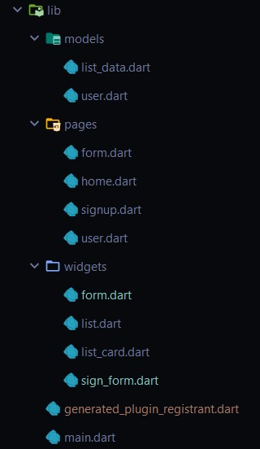

# Full fledged flutter LogIn and SignUp

## Getting Started

1. **Add following packages in your dependencies section of pubspec.yaml:**
```yaml
dependencies:
  flutter:
    sdk: flutter

  font_awesome_flutter:
  provider:
  firebase_auth:
  firebase_core:
  cloud_firestore:
  dbcrypt: ^1.0.0
  rflutter_alert:
  shared_preferences:
  # The following adds the Cupertino Icons font to your application.
  # Use with the CupertinoIcons class for iOS style icons.
  cupertino_icons: ^0.1.3
```
2. **Install above packages through pub which is flutter's package manager**
```aidl
flutter pub get
```
3. **Project structure looks like below:**

    

For help getting started with Flutter, view our
[online documentation](https://flutter.dev/docs), which offers tutorials,
samples, guidance on mobile development, and a full API reference.
